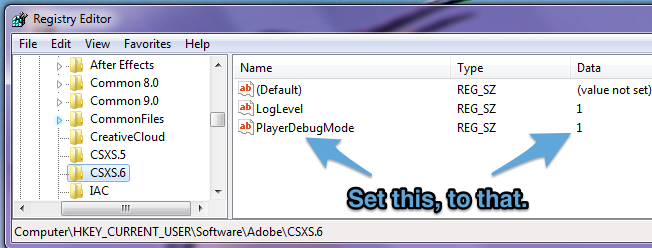

# How to develop Premiere Pro panels

---
### 1. Install these

* [Creative Cloud](http://creative.adobe.com). Use the Creative Cloud application to install the applications with which you'll be developing and testing, as well as ExtendScript Toolkit (available under 'previous versions').

* The [PProPanel](https://github.com/Adobe-CEP/Samples/tree/master/PProPanel)  sample project.

* The [ZXPSignCmd](https://github.com/Adobe-CEP/CEP-Resources/tree/master/ZXPSignCMD/3.0.19) signing utility creates signed .zxp bundles for Add-Ons or direct distribution.

		
### 2. Configure the environment 
Put PPro panel (or your own panel) here, to have Premiere Pro load it:
	
Windows: 	`C:\Program Files (x86)\Common Files\Adobe\CEP\extensions\PanelDir`
	
Mac:		`/Library/Application Support/Adobe/CEP/extensions/PanelDir`
	
Tell Premiere Pro to load unsigned panels.
	
On Mac, type the following into Terminal, then relaunch Finder:

	defaults write /Users/<username>/Library/Preferences/com.adobe.CSXS.6.plist PlayerDebugMode 1

On Windows, make the following registry entry:
	
	
### 3. Create your panel in JavaScript using your browser's developer tools

To enable debugging of panels using Chrome’s integrated debugger, put a file named `.debug` into your extension’s folder (as a peer of the `/CSXS` folder). The contents of the file should resemble the following:

	<?xml version="1.0" encoding="UTF-8"?>
	<ExtensionList>
        <Extension Id="com.example.PProPanel">
            <HostList>
                <Host Name="PPRO" Port="7777"/>
            </HostList>
        </Extension>
    </ExtensionList>
When the panel is active, you can debug the panel in your web browser by browsing to `localhost:7777`, and selecting your panel:

Optional: Turn on CEP logging. Find CEP logs (distinct from Premiere Pro's logs) here. Note that Mac Library path is the system's library, not the user's. 

Windows: `~\AppData\Local\Temp\csxs6-PPRO.log`

Mac:  `/Library/Logs/CSXS/csxs6-PPRO.log`

Set logging level in Windows Registry, or MacOS X .plist:

Windows: `HKEY_CURRENT_USER/Software/Adobe/CSXS.6`

Mac: `~/Library/Preferences/com.adobe.CSXS.6.plist`

### 4. Drive Premiere Pro from within ExtendScript Toolkit (ESTK)

Launch ESTK; Launch PPro, then then click the chain link to connect. 

Once in the session, use the Data Browser to view the DOM.

Prior to PPro 9.0, you could just click the chain link and PPro would launch. That no longer works with the shipping version of ESTK; launch PPro first, then connect. Also new in 9.0, set breakpoints in your panel's .jsx files, and they will break into ESTK; very handy! 

### **5. Package and deploy your panel**

You can either generate a self-signed certificate (ZXPSignCmd will make them for you), or get one from a commercial security provider. Here's an example:

	./ZXPSignCmd -selfSignedCert US California Adobe "Bruce Bullis" password certificate.p12

To sign directory `/PanelDir` with `certificate.p12`, do the following:

	./ZXPSignCmd -sign panelDir/ PanelName.zxp certificate.p12 password -tsa https://timestamp.geotrust.com/tsa

Submit your panel to the [Adobe Add-Ons site](https://www.adobeexchange.com/producer) for approval, and distribution. You can also directly supply the .zxp file enterprise customers, and those who do not connect their systems to the public internet, for installation using [ExManCmd](https://www.adobeexchange.com/resources/27), the command line version of Extension Manager.

