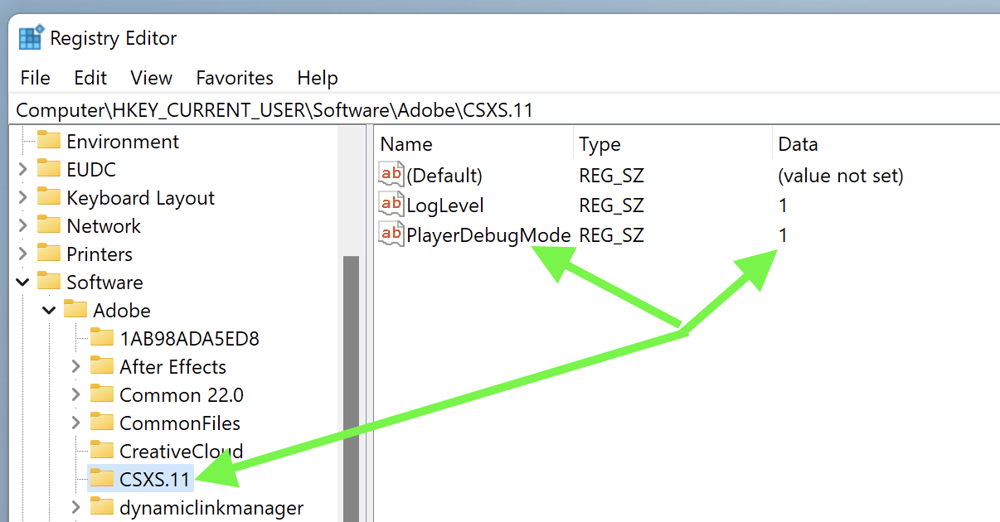

# Create panels for Premiere Pro

*Last updated April 2019, current released version = Premiere Pro 13.1, also known as "Premiere Pro 2019".*
    
# Premiere Pro 13.1 : API Improvements

We've added many new capabilities for the 13.1 release. All of these are exercised in the PProPanel sample, [available on GitHub](https://github.com/Adobe-CEP/Samples/tree/master/PProPanel).

### Sequence change messaging

Panels can now subscribe to be notified whenever something is added to, removed from, or changed in a sequence.

### Identify Team Projects

Persistently identify cloud-based Team Projects.

### Sequence work area API

Control the start, end, and enablement of the sequence work area.

### Remove track items

Track items can now be removed. 

### Render frames from sequences

Render frames from sequences into buffers.

### Control Workspaces

Retrieve available workspaces, and set the current workspace.


# Create panels for Premiere Pro

## 1. Obtain and install these

- [Creative Cloud](http://creative.adobe.com). Use the Creative Cloud
    application to install Premiere Pro CC and other Adobe applications with
    which you'll be developing and testing, as well as ExtendScript Toolkit
    (available under 'previous versions').

- The [CEP Test
    Panel](https://github.com/Adobe-CEP/CEP-Resources/tree/master/CEP_8.x/Samples/CEP_HTML_Test_Extension-8.0)
    shows the full capabilities of CEP panels.

- The [PProPanel](https://github.com/Adobe-CEP/Samples/tree/master/PProPanel)
    sample project is exhaustive in its exercise of Premiere Pro's ExtendScript
    API.

- The
    [ZXPSignCmd](https://github.com/Adobe-CEP/CEP-Resources/tree/master/ZXPSignCMD/4.0.7)
    signing utility creates signed .zxp bundles for Add-Ons or direct
    distribution.
    
- Microsoft Visual Studio Code, and the ExtendScript debugging extension. This extension running in VSCode is Adobe's recommended ExtendScript development environment. Sorry, ExtendScript Toolkit. 

- Use the [ExManCmd](https://www.adobeexchange.com/resources/28) command line
    utility to test .zxp installation.

## 2. Enable loading of unsigned panels

Further [relevant information](https://medium.com/adobetech/how-to-create-your-first-adobe-panel-in-6-easy-steps-f8bd4ed5778) is available from the Extensibility team.

*Note: Premiere Pro 13.0 integrates CEP9, so even if you had unsigned panels
loading before (using CEP7 or CEP8), you'll need to perform this step again, but for key CSXS.9.*

On Mac, type the following into Terminal, then relaunch Finder (either via
rebooting, or from the Force Quit dialog):

```html
defaults write /Users/<username>/Library/Preferences/com.adobe.CSXS.9.plist PlayerDebugMode 1
```

On Windows, make the following registry entry (a new Key, of type String):



## 3. Put panel into extensions directory

Put `/PProPanel` or your own panel's containing directory here, to have Premiere
Pro load it:

```html
Windows:    C:\Program Files (x86)\Common Files\Adobe\CEP\extensions
Mac:        /Library/Application Support/Adobe/CEP/extensions
```

## 4. Write and test your panel's JavaScript using a JavaScript debugger

To enable debugging of panels using Chrome’s developer tools, put a file named
`.debug` into your extension’s folder (as a peer of the `/CSXS` folder). The
contents of the file should resemble the following (and the Extension ID must
match the one in the panel's manifest):

```xml
<?xml version="1.0" encoding="UTF-8"?>
<ExtensionList>
    <Extension Id="com.example.PProPanel">
        <HostList>
            <Host Name="PPRO" Port="7777"/>
        </HostList>
    </Extension>
</ExtensionList>
```

When the panel is active, you can debug the panel in Chrome by
browsing to `localhost:7777`, and selecting your panel:


Note: You can also use Microsoft Visual Studio Code to debug your panel's JavaScript. 

Optional diagnostics: Turn on CEP logging. Find CEP logs (distinct from Premiere
Pro's logs) here. Note that Mac Library path is the system's library, not the
user's. Also, note that logging WILL impact performance.

```html
Windows:    %\AppData\Local\Temp\csxs8-PPRO.log
Mac:        /Library/Logs/CSXS/csxs8-PPRO.log
```

Set logging level in Windows Registry (see above), or MacOS X .plist:

```html
defaults write /Users/<username>/Library/Preferences/com.adobe.CSXS.7.plist LogLevel 6
```

## 5. Create your panel's ExtendScript using Microsoft Visual Studio Code

Once you've installed the ExtendScript debugging extension, you can set breakpoints in your ExtendScript code within VSCode. Here's a view of the debug configurations associated with the PProPanel sample, in VSCode:


Once in the session, you can hit breakpoints, and use ExtendScript Toolkit's
Data Browser to view the ExtendScript DOM.

Here's a [screen video](https://www.dropbox.com/s/lwo8jg0klxkq91s/walkthru.mp4)
showing how to debug panels at both the JavaScript and ExtendScript levels.

## 6. Package and deploy your panel

Further [relevant information](https://github.com/Adobe-CEP/Getting-Started-guides/tree/master/Package%20Distribute%20Install) is available from the Extensibility team.

You can either generate a self-signed certificate (ZXPSignCmd will make them for
you), or get one from a commercial security provider. Here's an example:

```bash
	./ZXPSignCmd -selfSignedCert US California Adobe "Bruce Bullis" password certificate.p12
```

To sign directory `/PanelDir` with `certificate.p12`, do the following:

```bash
    ./ZXPSignCmd -sign panelDir/ PanelName.zxp certificate.p12 password -tsa http://timestamp.digicert.com/
```

Submit your panel to the [Adobe Add-Ons
site](https://www.adobeexchange.com/producer) for approval, and distribution.
You can also directly supply the .zxp file enterprise customers, and those who
do not connect their systems to the public internet, for installation using
[ExManCmd](https://www.adobeexchange.com/resources/28), the command line version
of Extension Manager.

If you encounter any issues with the Add-Ons store or ExManCmd, please [contact
the Add-Ons team](mailto:jferman@adobe.com).

# Previous Updates

## What was new in 13.0

### Get and set footage interpretation

All aspects of Premiere Pro's footage interpretation are now available via API. Among other workflows, this enables panels to replace a footage reference, while preserving existing interpretation information the user may have already set.

### Get and set sequence settings

Previously, it was possible to clone existing sequences, and create sequences from a sequence preset. It is now possible to get and set each individual sequence setting, providing much more granular control over sequences.

### Detect trackItems which are reversed, have speed adjustments, or are adjustment layers

This important information was previously unavailable.

### Open projectItems in the Source monitor

This allows for sequences, multi-cam sequences, still image sequences and merged clips to be opened in the Source monitor.

### Create sub-sequences

Lift/extract sections of existing sequences into new ones, with control over whether or not to adopt the track mapping present in the original.

### Close open sequences

Close superfluous/distracting sequences.

### Consolidate Duplicates via API

Invoke the same duplicate consolidation functionality available to users.

## What was new in 12.1

### Get and set the current Project panel selection

It's now possible for a panel to know which `projectItems` are selected, and to select projectItems as appropriate.

### Consolidate and Transcode API

All functionality available from Premiere Pro's Project Manager dialog, is now available to panels.

### Improved time resolution for trackItems

We now provide (and accept) time values for track items in ticks, eliminating an opportunity for rounding error.

### Import and change Motion Graphics templates (.mogrts)

Panels can now insert .mogrt files into sequences, and change the parameters of those .mogrts as desired.

### Forcibly replace footage

It's now possible to force Premiere Pro to update the path to a given `projectItem`, even if Premiere Pro doesn't think such a change is advisable.

### Identify sequences

All `projectItems` now have an `isSequence()` method; this eliminates the need to compare a list of 'all project items' against a list of 'all sequences', to determine which `projectItems` are and are not sequences.

### Set the frame rate for projectItems

Use the handy new `setOverrideFramerate()`.

### API Documentation

While the sample panel should continue to be your first option for working example code, Premiere Pro's ExtendScript API [is documented here](http://ppro.aenhancers.com), to enable developer participation.

## What was new in 12.0

- We've extended our new, not-in-the-QE-DOM Source monitor object, to close the [front-most](https://github.com/Adobe-CEP/Samples/blob/master/PProPanel/jsx/PPRO/Premiere.jsx#L1465) or [all open clips](https://github.com/Adobe-CEP/Samples/blob/master/PProPanel/jsx/PPRO/Premiere.jsx#L1469).

- [Change the Label](https://github.com/Adobe-CEP/Samples/blob/master/PProPanel/jsx/PPRO/Premiere.jsx#L1473) assigned to projectItems.

- Query PPro for the [current insertion bin](https://github.com/Adobe-CEP/Samples/blob/master/PProPanel/jsx/PPRO/Premiere.jsx#L1486), the default target for items imported into the project (but not via drag). *Previously, you could set, but not get, the insertion bin.*

- [Import Compositions](https://github.com/Adobe-CEP/Samples/blob/master/PProPanel/jsx/PPRO/Premiere.jsx#L1502) by name, from After Effects projects.

- Open PPro's Events panel to see PProPanel's feedback; I've minimized modal alerts.
