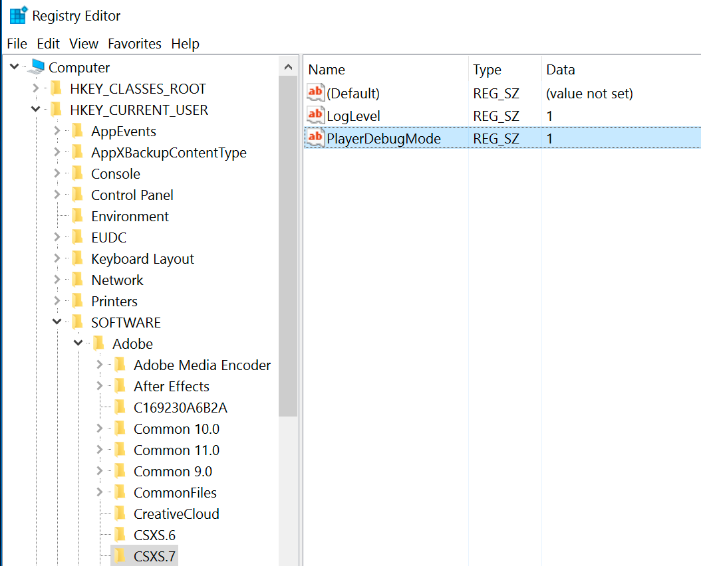
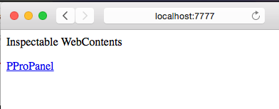

# Create panels for Premiere Pro
==============================

*Last updated April 24 2017, current released version = Premiere Pro 11.1.*

## What's Possible?

For the impatient, here are links to working sample code, showing what's
possible for Premiere Pro panels:

-   [Browse and import files from the
    OS](https://github.com/Adobe-CEP/Samples/blob/master/PProPanel/jsx/Premiere.jsx#L215)

-   [Get and set all XMP
    metadata](https://github.com/Adobe-CEP/Samples/blob/master/PProPanel/jsx/Premiere.jsx#L508)
    (including Premiere Pro's [private project
    metadata](https://github.com/Adobe-CEP/Samples/blob/master/PProPanel/jsx/Premiere.jsx#L659))
    for any projectItem.

-   [Import files via drag and
    drop](https://github.com/Adobe-CEP/Samples/blob/master/PProPanel/ext.js#L47),
    from a panel into Premiere Pro (Project panel, or directly onto a timeline).

-   [Preview any supported media in the Source
    monitor](https://github.com/Adobe-CEP/Samples/blob/master/PProPanel/jsx/Premiere.jsx#L190)
    (without requiring that it be imported into the project).

-   Access and modify [clip
    markers](https://github.com/Adobe-CEP/Samples/blob/master/PProPanel/jsx/Premiere.jsx#L629),
    and [sequence
    markers](https://github.com/Adobe-CEP/Samples/blob/master/PProPanel/jsx/Premiere.jsx#L121).

-   [Create new
    sequences](https://github.com/Adobe-CEP/Samples/blob/master/PProPanel/jsx/Premiere.jsx#L349)
    either from a preset, or with user interaction.

-   [Open different
    projects](https://github.com/Adobe-CEP/Samples/blob/master/PProPanel/jsx/Premiere.jsx#L288)
    (while the panel remains active; this behavior is new as of Premiere Pro
    10.3).

-   [Render a
    sequence](https://github.com/Adobe-CEP/Samples/blob/master/PProPanel/jsx/Premiere.jsx#L412)
    to any destination(s), based on any preset(s), including ftp upload, and
    controlling metadata output.

-   Export either a [given
    sequence](https://github.com/Adobe-CEP/Samples/blob/master/PProPanel/jsx/Premiere.jsx#L164)
    or the entire project as Final Cut Pro 7 XML.

-   [Save as a new
    project](https://github.com/Adobe-CEP/Samples/blob/master/PProPanel/jsx/Premiere.jsx#L487),
    or create a new project containing only a specified sequence and its
    constituent media.

## 1. Obtain and install these

-   [Creative Cloud](http://creative.adobe.com). Use the Creative Cloud
    application to install Premiere Pro CC and other Adobe applications with
    which you'll be developing and testing, as well as ExtendScript Toolkit
    (available under 'previous versions').

-   The [CEP Test
    Panel](https://github.com/Adobe-CEP/Samples/tree/master/CEP_HTML_Test_Extension)
    shows the full capabilities of CEP panels.

-   The [PProPanel](https://github.com/Adobe-CEP/Samples/tree/master/PProPanel)
    sample project is exhaustive in its exercise of Premiere Pro's ExtendScript
    API.

-   The
    [ZXPSignCmd](https://github.com/Adobe-CEP/CEP-Resources/tree/master/ZXPSignCMD/4.0.7)
    signing utility creates signed .zxp bundles for Add-Ons or direct
    distribution.

-   Use the [ExManCmd](https://www.adobeexchange.com/resources/28) command line
    utility to test .zxp installation.

## 2. Enable loading of unsigned panels
 
*Note: Premiere Pro 11.1 has integrated CEP7, so even if you had unsigned panels
loading before (using CEP6), you'll need to perform this step again, but for key CSXS.7 instead of CSXS.6.*

On Mac, type the following into Terminal, then relaunch Finder (either via
rebooting, or from the Force Quit dialog):

```
defaults write /Users/<username>/Library/Preferences/com.adobe.CSXS.7.plist PlayerDebugMode 1
```

On Windows, make the following registry entry (a new Key, of type String):



## 3. Put panel into extensions directory

Put `/PProPanel` or your own panel's containing directory here, to have Premiere
Pro load it:

```
Windows: 	C:\Program Files (x86)\Common Files\Adobe\CEP\extensions
Mac: 		/Library/Application Support/Adobe/CEP/extensions
```

## 4. Write and test your panel's JavaScript using Chrome debugger

To enable debugging of panels using Chrome’s developer tools, put a file named
`.debug` into your extension’s folder (as a peer of the `/CSXS` folder). The
contents of the file should resemble the following (and the Extension ID must
match the one in the panel's manifest):

~~~~~~~~~~~~~~~~~~~~~~~~~~~~~~~~~~~~~~~~~~~~~~~~~~~~~~~~~~~~~~~~~~~~~~~~~~~~~~~~
<?xml version="1.0" encoding="UTF-8"?>
<ExtensionList>
    <Extension Id="com.example.PProPanel">
        <HostList>
            <Host Name="PPRO" Port="7777"/>
        </HostList>
    </Extension>
</ExtensionList>
~~~~~~~~~~~~~~~~~~~~~~~~~~~~~~~~~~~~~~~~~~~~~~~~~~~~~~~~~~~~~~~~~~~~~~~~~~~~~~~~

When the panel is active, you can debug the panel in your web browser by
browsing to `localhost:7777`, and selecting your panel:



Optional diagnostics: Turn on CEP logging. Find CEP logs (distinct from Premiere
Pro's logs) here. Note that Mac Library path is the system's library, not the
user's. Also, note that logging WILL impact performance.

```
Windows: 	%\AppData\Local\Temp\csxs7-PPRO.log
Mac: 		/Library/Logs/CSXS/csxs7-PPRO.log
```

Set logging level in Windows Registry (see above), or MacOS X .plist:

```
defaults write /Users/<username>/Library/Preferences/com.adobe.CSXS.7.plist LogLevel 6
```

## 5. Create your panel's ExtendScript using ExtendScript Toolkit (ESTK)

Launch ExtendScript Toolkit, select the correct version of Premiere Pro from the
drop-down menu, then then click the chain link to connect.


Once in the session, you can hit breakpoints, and use ExtendScript Toolkit's
Data Browser to view the ExtendScript DOM.

Here's a [screen video](https://www.dropbox.com/s/lwo8jg0klxkq91s/walkthru.mp4)
showing how to debug panels at both the JavaScript and ExtendScript levels.

## 6. Package and deploy your panel

You can either generate a self-signed certificate (ZXPSignCmd will make them for
you), or get one from a commercial security provider. Here's an example:

~~~~~~~~~~~~~~~~~~~~~~~~~~~~~~~~~~~~~~~~~~~~~~~~~~~~~~~~~~~~~~~~~~~~~~~~~~~~~~~~
./ZXPSignCmd -selfSignedCert US California Adobe "Bruce Bullis" password certificate.p12
~~~~~~~~~~~~~~~~~~~~~~~~~~~~~~~~~~~~~~~~~~~~~~~~~~~~~~~~~~~~~~~~~~~~~~~~~~~~~~~~

To sign directory `/PanelDir` with `certificate.p12`, do the following:

~~~~~~~~~~~~~~~~~~~~~~~~~~~~~~~~~~~~~~~~~~~~~~~~~~~~~~~~~~~~~~~~~~~~~~~~~~~~~~~~
./ZXPSignCmd -sign panelDir/ PanelName.zxp certificate.p12 password -tsa https://timestamp.geotrust.com/tsa
~~~~~~~~~~~~~~~~~~~~~~~~~~~~~~~~~~~~~~~~~~~~~~~~~~~~~~~~~~~~~~~~~~~~~~~~~~~~~~~~

Submit your panel to the [Adobe Add-Ons
site](https://www.adobeexchange.com/producer) for approval, and distribution.
You can also directly supply the .zxp file enterprise customers, and those who
do not connect their systems to the public internet, for installation using
[ExManCmd](https://www.adobeexchange.com/resources/28), the command line version
of Extension Manager.

If you encounter any issues with the Add-Ons store or ExManCmd, please [contact
the Add-Ons team](mailto:jferman@adobe.com).
